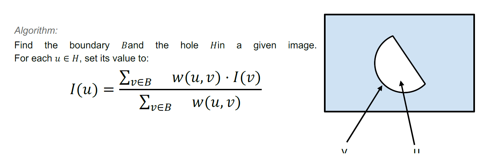
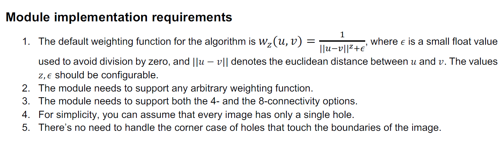

# Image Hole Filling
The goal is to build a small image processing module that fills holes in images, along with a small command line
utility that uses that module. Note that while the required tool functionality now is very basic we expect more
features to be added to the tool in the future, therefore flexibility in the design and good separation of concerns
is something we care about.
The exercise has to be implemented in Python. You may use open-source libraries, provided that they do not
implement hole filling logic.


## Hole Filling Algorithm
### Definitions:

* 𝐼: the input image.
* 𝐼(𝑣): color of the pixel at coordinate 𝑣 ∈ ℤ!.
* 𝐵: set of all the boundary pixel coordinates. A boundary pixel is defined as a pixel that is connected to a
hole pixel, but is not in the hole itself. Pixels can be either 4- or 8-connected. See this for more info.
* 𝐻: set of all the hole (missing) pixel coordinates. You can assume the hole pixels are either 4- or 8-
connected.
* 𝑤(𝑣, 𝑢) : weighting function which assigns a non-negative float weight to a pair of two pixel coordinates
in the image.


<p align="center">

</p>

 

[](https://github.com/hhatto/autopep8)


<p align="center">

</p>

### Command-line tool requirements
The hole filler should be a command-line tool that is executed with four arguments - the path to the image or
images, a prefix for the mask image name, an output path and the configuration of the weight function.
For example:

```console
> python hole_filler.py ./data/test.png mask_ ./output/test_filled.jpg
weight_conf.json
```

The tool should support paths to a specific image as well as to folders with multiple images.
It is assumed that for each image file, e.g. image.jpg, there is a matching image file for the mask using the
same name and the added prefix, e.g. mask_image.png. The mask image should be a single channel image
where any value larger than 0 is considered a hole pixel. The image formats may vary between image and
mask.
The output path can be an explicit image name or a folder in case of multiple images. Give a reasonable
solution for naming of multiple outputs.
The weight function configuration implementation should support the parameters of the default weight function
and allow for any other configuration that may be supported by extensions to the underlying module.


